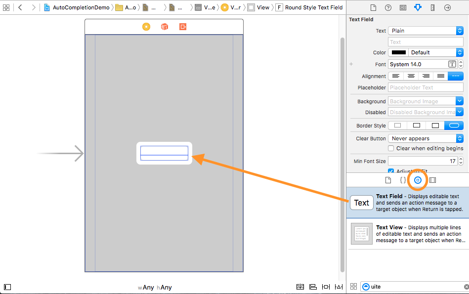
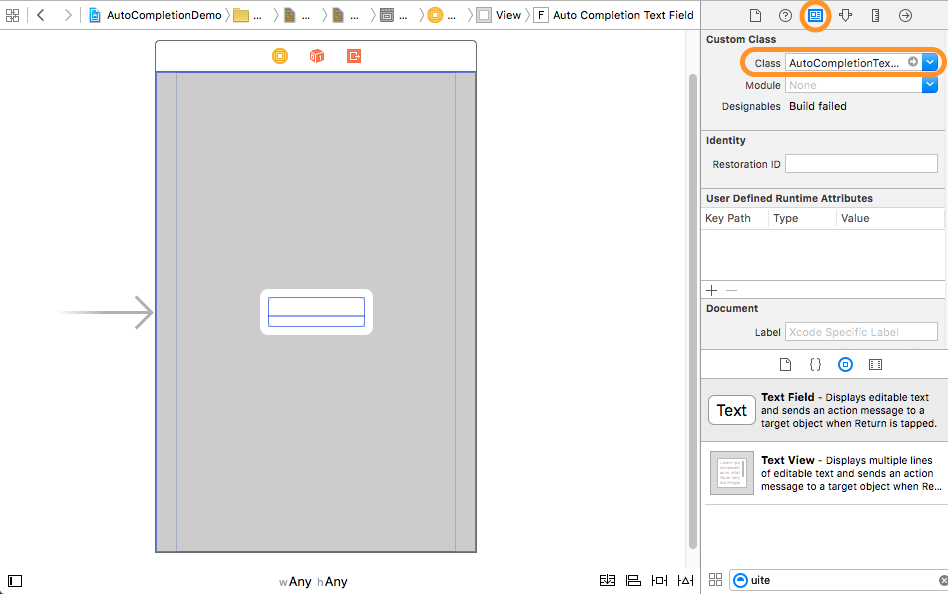
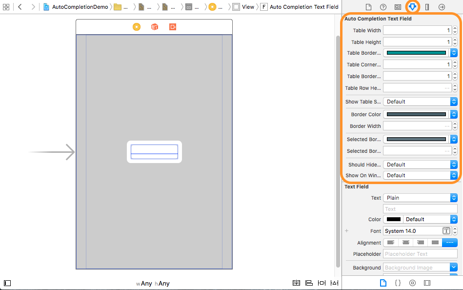
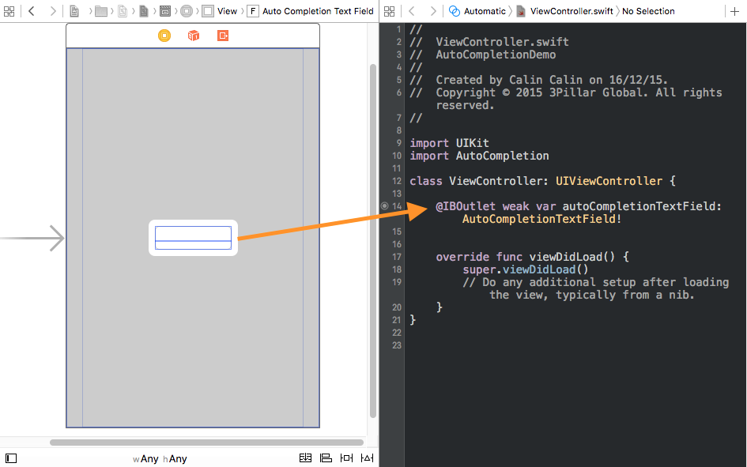

# AutoCompletion


## Description

A framework which provides text field suggestions as a dropdown list. It is available with iOS 9 and later, Objective-C or Swift.

**Project Rationale**

The purpose of this framework is to provide a simple, yet very useful feature - autocomplete textfield. IOS autocomplete is an iOS module that behaves like a normal text field with the added functionality that it provides suggestions to the user in a dropdown. 


## Installation

###CocoaPods Installation

Run Terminal

- Navigate to project folder
- Use command:

``` code
pod init
```
- Add code to podfile

```
platform :ios, '9.0'

target 'YourProjectName' do
  use_frameworks!
    pod 'AutoCompletion'
end

```
- Remember to open project using workspace

###Carthage Installation

Run Terminal

- Navigate to project folder
- Add code to Cartfile:

``` code
github "3pillarlabs/ios-autocomplete"
```

- Run carthage by using command:

``` code
carthage update
```
- Add the "AutoCompletion.framework" to the list of "Embedded Binaries" (located inside Xcode -> Target -> General tab) from Carthage/Build/iOS in project folder

## Usage

1\. Import **AutoCompletion** framework.
**Objective-C**

```objective-c
@import AutoCompletion; 
```

**Swift**

```swift
import AutoCompletion 
```

2\. Add an autocompletion instance inside a view:

2.1 Drag and drop a UITextField instance in Interface Builder.



2.2 Change it's class to AutoCompletionTextField.



2.3 Aditionally, you can customize the text field from Interface Builder.



2.4 Create a reference of the AutoCompletionTextField.


<br />
<br />

3\. Set the **suggestionsResultDataSource**. The data source needs to conform to the **AutoCompletionTextFieldDataSource** protocol:

**Swift**

```swift
class AutoCompletionDataSource: NSObject, AutoCompletionTextFieldDataSource {
	@IBOutlet weak var autoCompletionTextField: AutoCompletionTextField!

    override func viewDidLoad() {
        super.viewDidLoad()
        autoCompletionOutlet.suggestionsResultDataSource = self
    }
    // MARK: DataSource
    
    func fetchSuggestions(forIncompleteString incompleteString: String!,
                          withCompletionBlock completion: FetchCompletionBlock!) {
        ...code...
    }
}
```

**Objective-C**

```objective-c
@interface AutoCompletionDataSource: NSObject <AutoCompletionTextFieldDataSource>
@end

@implementation AutoCompletionDataSource
- (void)fetchSuggestionsForIncompleteString:(NSString*)incompleteString
                        withCompletionBlock:(FetchCompletionBlock)completion {
    ...code...
}
@end

...

autoCompletionTextField.suggestionsResultDataSource = [AutoCompletionDataSource new];
```

4\. Optionally, you can set the **suggestionsResultDelegate** in order to handle the suggestion selection. 

**Swift**

```swift
class ViewController: UIViewController, AutoCompletionTextFieldDelegate {    
    @IBOutlet weak var autoCompletionTextField: AutoCompletionTextField!

    override func viewDidLoad() {
        super.viewDidLoad()
        autoCompletionTextField.suggestionsResultDelegate = self
    }
    
    // MARK: Delegate
    
    func textField(_ textField: AutoCompletionTextField!, didSelectItem selectedItem: Any!) {
		...code...
    }
}
```

**Objective-C**

```objective-c
@interface ViewController: UIViewController <AutoCompletionTextFieldDelegate>

@property (weak, nonatomic) IBOutlet AutoCompletionTextField *autoCompletionTextField;

@end

@implementation ViewController

- (void)viewDidLoad {
    [super viewDidLoad];
    self.autoCompletionTextField.suggestionsResultDelegate = self;
}

#pragma mark - Delegate

- (void)textField:(AutoCompletionTextField*)textField didSelectItem:(id)selectedItem {
	...code...
}
```

5\. Also, you can set the **animationDelegate** in order to provide a custom animation to displaying of the results. It needs to conform to the **AutoCompletionAnimator** protocol:

**Swift**

```swift
class AutoCompletionAnimation: NSObject, AutoCompletionAnimator {
    
    func showSuggestions(for textField: AutoCompletionTextField!,
                         table: UITableView!, numberOfItems count: Int) {
    	...code...    
   	 }
    
    func hideSuggestions(for textField: AutoCompletionTextField!,
                         table: UITableView!) {
    	...code...
    }
}

...

autoCompletionTextField.animationDelegate = AutoCompletionAnimation()
```

**Objective-C**

```objective-c
@interface AutoCompletionAnimation: NSObject<AutoCompletionAnimator>
@end

@implementation AutoCompletionAnimation

- (void)showSuggestionsForTextField:(AutoCompletionTextField*)textField
                              table:(UITableView*)table
                      numberOfItems:(NSInteger)count {
	...code...
}
- (void)hideSuggestionsForTextField:(UITextField*)textField
                              table:(UITableView*)table {
	...code...
}

@end

...

autoCompletionTextField.animationDelegate = [AutoCompletionAnimation new];
```
<br />

In the demo branch you're able to see a workable example for AutoCompletion where the suggestions results come from three different scenarios: CoreData, JSON, and API.

## Known issues

If written text and suggestion have different letter case or if written text starts shifting to left, the suggestion doesn't overlap correctly the written text.

## License

**AutoCompletion** is released under MIT license. See [LICENSE](LICENSE) for details.  

## About this project
![3Pillar Global] (http://www.3pillarglobal.com/wp-content/themes/base/library/images/logo_3pg.png)

**AutoCompletion** is developed and maintained by [3Pillar Global](http://www.3pillarglobal.com/).


