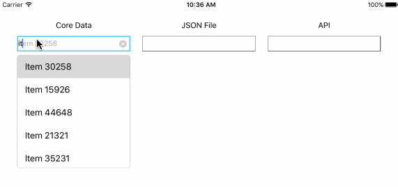

# AutoCompletion


## Description

Demo application for our framework which provides text field suggestions as a dropdown list. It is available with iOS 9 and later, Objective-C or Swift.

**Project Rationale**

The purpose of this framework is to provide a simple, yet very useful feature - autocomplete textfield. IOS autocomplete is an iOS module that behaves like a normal text field with the added functionality that it provides suggestions to the user in a dropdown. 



In this demo branch you're able to see a workable example for AutoCompletion where the suggestions results come from three different scenarios: CoreData, JSON, and API.

## Installation

###CocoaPods Installation

Run Terminal

- Navigate to project folder
- Use command:

``` code
pod install
```
- Remember to open project using workspace

###Carthage Installation

Run Terminal

- Navigate to project folder
- Run carthage by using command:

``` code
carthage update
```
- Add the "AutoCompletion.framework" to the list of "Embedded Binaries" (located inside Xcode -> Target -> General tab) from Carthage/Build/iOS in project folder


## Known issues

If written text and suggestion have different letter case or if written text starts shifting to left, the suggestion doesn't overlap correctly the written text.

## License

**AutoCompletion** is released under MIT license. See [LICENSE](LICENSE) for details.  

## About this project
![3Pillar Global] (http://www.3pillarglobal.com/wp-content/themes/base/library/images/logo_3pg.png)

**AutoCompletion** is developed and maintained by [3Pillar Global](http://www.3pillarglobal.com/).


